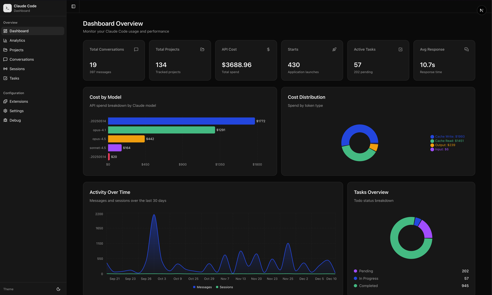

# Claude Code Dashboard

A comprehensive admin interface for debugging, inspecting, and analyzing your Claude Code usage. Built with Next.js 15 and shadcn/ui.



## Overview

Claude Code Dashboard provides a centralized view of all your Claude Code data, including:

- **Usage Analytics** - Track API costs, token consumption, and activity patterns
- **Project Management** - Browse all 134+ tracked projects with their configurations
- **Conversation History** - Search and review past sessions and message threads
- **Task Tracking** - View todos and plans across all projects
- **Configuration** - Inspect global settings, permissions, and MCP servers
- **Debug Logs** - Browse debug output for troubleshooting

## Features

### Dashboard Home
- **Stats Cards** - Total cost, messages, conversations, projects, and response times
- **Cost by Model** - Bar chart breakdown of API spend per Claude model
- **Cost Distribution** - Donut chart showing spend by token type (input, output, cache read, cache write)
- **Activity Chart** - 30-day trend of messages and sessions
- **Tasks Overview** - Pie chart of todo statuses
- **Recent Sessions** - Quick access to latest conversations

### Analytics
- 90-day activity trends
- Model usage comparison with detailed token breakdowns
- Hourly usage distribution heatmap
- Cost calculations using actual API pricing:
  - **Sonnet**: $3/MTok input, $15/MTok output
  - **Opus**: $15/MTok input, $75/MTok output
  - Cache read: 10% of input price
  - Cache write: 125% of input price

### Projects
- List all tracked projects with costs and activity
- Project detail pages with:
  - MCP server configurations
  - Allowed tools
  - Ignore patterns
  - Trust dialog status
  - Message history

### Conversations
- Browse all sessions with timestamps and costs
- Message thread viewer with:
  - User and assistant messages
  - Tool call visualization
  - Cost per message
  - Model used

### Sessions
- Active session environments
- Shell snapshots viewer
- Environment variable inspection

### Tasks
- **Todos Tab** - Browse all 649+ todo files with status filtering
- **Plans Tab** - View all 17+ plan markdown files

### Extensions
- Custom slash commands (15+ commands)
- Agent configurations
- Skill definitions

### Settings
- Global configuration from `~/.claude/settings.json`
- Permission rules (allow/deny lists)
- Environment variables
- Thinking mode settings

### Debug
- Browse 50+ debug log files
- Syntax-highlighted log viewer
- File size and timestamp info

## Installation

### Prerequisites
- Node.js 18+
- Claude Code installed (`~/.claude` directory must exist)

### Setup

```bash
# Clone or navigate to the project
cd claude-code-dashboard

# Install dependencies
npm install

# Start development server
npm run dev

# Or build for production
npm run build
npm start
```

The dashboard will be available at `http://localhost:3000`.

## Data Sources

The dashboard reads data from your local Claude Code installation:

| Data | Source | Format |
|------|--------|--------|
| Messages & Sessions | `~/.claude/__store.db` | SQLite |
| Projects | `~/.claude.json` | JSON |
| Statistics | `~/.claude/stats-cache.json` | JSON |
| Todos | `~/.claude/todos/` | JSON |
| Plans | `~/.claude/plans/` | Markdown |
| Commands | `~/.claude/commands/` | Markdown |
| Settings | `~/.claude/settings.json` | JSON |
| Debug Logs | `~/.claude/debug/` | Text |
| Sessions | `~/.claude/session-env/` | Env files |
| Shell Snapshots | `~/.claude/shell-snapshots/` | Text |

**Note**: All data access is read-only. The dashboard never modifies your Claude Code data.

## Tech Stack

- **Framework**: [Next.js 15](https://nextjs.org/) (App Router)
- **UI Components**: [shadcn/ui](https://ui.shadcn.com/)
- **Styling**: [Tailwind CSS v4](https://tailwindcss.com/)
- **Charts**: [Recharts](https://recharts.org/) via shadcn/ui chart components
- **Database**: [better-sqlite3](https://github.com/WiseLibs/better-sqlite3) (read-only)
- **Date Handling**: [date-fns](https://date-fns.org/)
- **Icons**: [Lucide React](https://lucide.dev/)
- **Theme**: [next-themes](https://github.com/pacocoursey/next-themes) (dark/light mode)

## Project Structure

```
claude-code-dashboard/
├── src/
│   ├── app/                    # Next.js App Router pages
│   │   ├── page.tsx           # Dashboard home
│   │   ├── analytics/         # Usage analytics
│   │   ├── projects/          # Projects list & detail
│   │   ├── conversations/     # Sessions & messages
│   │   ├── sessions/          # Active sessions
│   │   ├── tasks/             # Todos & plans
│   │   ├── extensions/        # Commands, agents, skills
│   │   ├── settings/          # Configuration
│   │   └── debug/             # Log viewer
│   ├── components/
│   │   ├── ui/                # shadcn/ui components
│   │   ├── layout/            # Sidebar, navigation
│   │   ├── dashboard/         # Stats cards, charts
│   │   └── analytics/         # Analytics-specific charts
│   ├── lib/
│   │   ├── db/                # SQLite queries
│   │   ├── data/              # File parsers (JSON, JSONL, MD)
│   │   └── utils.ts           # Utility functions
│   └── types/                 # TypeScript definitions
├── public/                    # Static assets
└── package.json
```

## API Cost Calculation

The dashboard calculates accurate API costs from token counts since the `costUSD` field in stats is often zero. Pricing used:

### Claude Sonnet
| Token Type | Price per Million |
|------------|-------------------|
| Input | $3.00 |
| Output | $15.00 |
| Cache Read | $0.30 (10%) |
| Cache Write | $3.75 (125%) |

### Claude Opus
| Token Type | Price per Million |
|------------|-------------------|
| Input | $15.00 |
| Output | $75.00 |
| Cache Read | $1.50 (10%) |
| Cache Write | $18.75 (125%) |

## Configuration

### Theme
Toggle between light and dark mode using the theme switcher in the sidebar.

### Refresh
Data is fetched on each page load. Use browser refresh to update data.

## Development

```bash
# Run development server with hot reload
npm run dev

# Type checking
npx tsc --noEmit

# Build for production
npm run build

# Start production server
npm start
```

## Troubleshooting

### "Database not found" error
Ensure Claude Code is installed and has been used at least once. The SQLite database is created after your first conversation.

### Empty projects list
The `~/.claude.json` file must exist with project data. This is created automatically by Claude Code.

### Incorrect costs showing
Costs are calculated from token counts in `stats-cache.json`. If this file is missing or incomplete, costs may be inaccurate.

## License

MIT

## Acknowledgments

- Built for use with [Claude Code](https://claude.ai/claude-code) by Anthropic
- UI components from [shadcn/ui](https://ui.shadcn.com/)
- Charts powered by [Recharts](https://recharts.org/)
